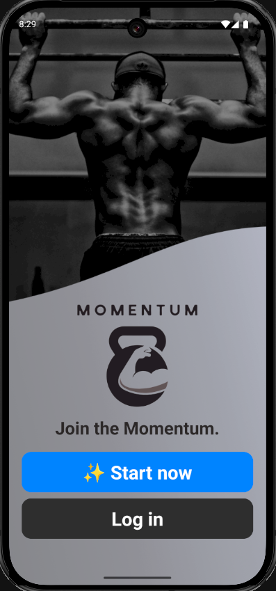

# Momentum  
### The gym app with all your needs — because progress shouldn't pause.

  

## 🚀 Overview
**Momentum** is an all-in-one fitness and nutrition tracking app tailored for Singaporeans. Designed to make wellness effortless and enjoyable, Momentum empowers users to track their workouts, monitor their diets, and stay consistent with personalized, AI-powered support. Whether you're aiming for a fitness streak, building strength, or improving eating habits — Momentum is your smart gym companion.

---

## 🎯 Aim  
To support Singaporeans in achieving their fitness goals through personalized workout planning, nutrition tracking, and social motivation — all from a single mobile app.

---

## ✨ Key Features  

### 1. 🔐 Authentication  
Secure and seamless login system.  
- Register and log in with email & password  
- Google Sign-In integration for convenience

### 2. 🏋️ Workout Tracking  
Record workout sets, reps, and duration.  
- Add workouts manually  
- View workout history grouped by date  
- Track daily and weekly performance

### 3. 🔄 AI-Powered Workout Plan  
Get personalized workout routines generated with AI.  
- Set your fitness goal  
- View and save AI-generated plans  
- Update or regenerate anytime

### 4. 🍱 Diet Tracking  
Monitor your daily calorie intake.  
- Set daily calorie goals (deficit or surplus)  
- Log food entries manually  
- View food history and remaining calories  
- Visual feedback on surplus or deficit in real time

### 5. 🧑‍🤝‍🧑 Friend System  
Stay motivated with your fitness circle.  
- Search and add friends by username  
- Accept or reject requests  
- View your friends' profiles, workouts, and diet history (if privacy settings allow)

### 6. 🥇 Leaderboard  
See where you stand.  
- Compare workout performance with friends  
- Filter by time spent or max weight  
- Real-time ranking updates

### 7. 📊 Streak Tracker  
Build healthy habits with consistency.  
- Tracks your daily workout and diet activity  
- Visual indicator of ongoing streaks  
- Encourages long-term progress

### 8. 👤 Profile & Settings  
Manage your experience.  
- View your stats (weekly workouts, total time, streaks)  
- Change username, password, or profile picture  
- Toggle privacy settings for workout/diet history  
- Delete account securely  
- Enable/disable dark mode

---

## 🔄 Tech Stack  
- **Frontend:** React Native (with Expo), Reanimated, Responsive Screen, Keyboard Controller  
- **Backend:** Firebase Firestore, Firebase Authentication, Firebase Storage  
- **AI Integration:** Gemini API (for workout plan generation)  
- **Storage & Hosting:** Firebase and Render

---
